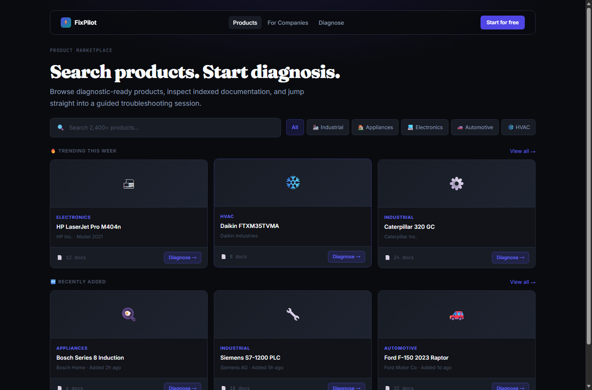

# CodeCitadel FixPilot

## Team Name

CodeCitadel

## Team Members

- Saksham Gupta
- Vansh Arora
- Harleen Kaur

## Live Links

- Website: https://codecitadel-fixpilot.vercel.app
- Frontend: https://codecitadel-fixpilot.vercel.app
- Backend API: https://codecitadel-backend-v2.onrender.com
- Backend health check: https://codecitadel-backend-v2.onrender.com/health

## Project Overview

CodeCitadel FixPilot is an AI-powered product support and diagnostic platform. It helps users troubleshoot product issues by combining product documentation, semantic search, and AI reasoning into one guided support experience.

Instead of forcing users to search through manuals or static FAQ pages, FixPilot lets them describe a problem in natural language. The system searches indexed product knowledge, identifies likely causes, asks follow-up questions, and recommends next steps with documentation-backed evidence.

The project is designed for hackathon evaluation as a full-stack application:

- The frontend is a Next.js marketplace and support dashboard.
- The backend is a FastAPI service for products, knowledge ingestion, search, chat, and diagnosis.
- Moss is used for document indexing and semantic retrieval.
- Gemini is used for diagnostic reasoning and support responses.

## Problem Statement

Product support is often slow because documentation is scattered across manuals, PDFs, web pages, and internal notes. Users may not know the exact model, error code, or troubleshooting path. Support teams also need faster ways to turn documentation into useful answers.

FixPilot addresses this by creating an AI support layer that can:

1. Store products and product documentation.
2. Index knowledge for retrieval.
3. Understand user-reported symptoms.
4. Generate guided troubleshooting steps.
5. Cite the documentation used to support each answer.

## Features and Functionality

### Product Marketplace

- Browse available products in a polished marketplace UI.
- Search and filter products by name, category, and description.
- Open product detail pages with support-focused product information.

### Diagnostic Assistant

- Describe a product issue in natural language.
- Run global diagnosis across all registered products.
- Run product-specific diagnosis from a product page.
- Receive likely causes, confidence, follow-up questions, and recommended actions.
- Continue a troubleshooting session with follow-up answers.

### AI-Powered Reasoning

- Gemini generates structured diagnostic responses.
- Responses include possible causes, eliminated causes, most likely cause, reasoning, next step, and documentation references.
- Graceful fallback responses keep the app usable when the AI service is unavailable.

### Knowledge Ingestion

- Upload PDF manuals.
- Add plain text troubleshooting notes.
- Add URL-based documentation.
- Reindex knowledge sources when content changes.
- View import status from the dashboard.

### Semantic Search

- Moss indexes product knowledge.
- Search retrieves relevant documentation snippets for support questions and diagnostic reasoning.
- Indexed references are used to make answers more grounded and easier for judges to evaluate.

### Demo-Friendly Upload Flow

- The frontend includes a `DEMO_MODE` switch for polished hackathon recordings.
- When demo mode is enabled, product upload simulates AI analysis with loading states and generated marketplace-style product data.
- The real backend integration remains available and can be restored by changing one flag.

### Production Deployment

- Frontend deployed on Vercel.
- Backend deployed on Render.
- Vercel API routes proxy requests to the deployed FastAPI backend through `API_BASE_URL`.

## Tech Stack Used

### Frontend

- Next.js 16 App Router
- React 19
- TypeScript
- Tailwind CSS
- Next.js API routes
- Vercel

### Backend

- Python
- FastAPI
- Uvicorn
- Pydantic
- Local JSON storage for products, documents, and diagnostic sessions
- `pypdf` for PDF extraction
- Render

### AI, Search, and Retrieval

- Gemini for support reasoning and diagnostics
- Moss for semantic indexing and search
- Seeded product documentation for immediate demo readiness

## Architecture

```text
User
  |
  v
Next.js frontend on Vercel
  |
  |  Marketplace, dashboard, product pages, diagnostic assistant
  v
Next.js API routes
  |
  |  Uses API_BASE_URL
  v
FastAPI backend on Render
  |
  |  Products, knowledge ingestion, search, sessions, diagnostics
  v
Moss semantic search + Gemini diagnostic reasoning
```

The frontend calls local Next.js API routes such as `/api/products` and `/api/diagnose/global`. Those API routes forward requests to the FastAPI backend. This keeps backend URLs and credentials out of browser-side code.

## Screenshots

### Marketplace


<br>


## Setup and Installation Instructions

### Prerequisites

- Node.js 20 or later
- npm
- Python 3.10 or later
- Gemini API key
- Moss project credentials

### 1. Clone the Repository

```powershell
git clone <your-repository-url>
cd CodeCitadel
```

### 2. Install Frontend Dependencies

```powershell
npm install
```

### 3. Configure Frontend Environment

Create `.env.local` in the repository root:

```powershell
Copy-Item .env.local.example .env.local
```

Set the backend URL:

```env
API_BASE_URL=http://localhost:8000
NEXT_PUBLIC_API_BASE_URL=http://localhost:8000
```

For the deployed production frontend, Vercel should use:

```env
API_BASE_URL=https://codecitadel-backend-v2.onrender.com
```

### 4. Install Backend Dependencies

```powershell
cd backend
python -m venv .venv
.\.venv\Scripts\Activate.ps1
pip install -r requirements.txt
```

### 5. Configure Backend Environment

Create `backend/.env`:

```powershell
Copy-Item .env.example .env
```

Fill in the required values:

```env
MOSS_PROJECT_ID=your_moss_project_id
MOSS_PROJECT_KEY=your_moss_project_key
GEMINI_API_KEY=your_gemini_api_key

# Optional configuration
MOSS_INDEX_NAME=product-support
MOSS_MODEL_ID=moss-minilm
MOSS_WAIT_FOR_INDEX_SECONDS=120
MOSS_SEARCH_ALPHA=0.7
GEMINI_MODEL=gemini-3.1-flash-lite
GEMINI_TIMEOUT_SECONDS=30
```


## Running Locally

### Start the Backend

From the `backend` directory:

```powershell
python -m uvicorn app:app --reload
```

Backend URL:

```text
http://localhost:8000
```

FastAPI docs:

```text
http://localhost:8000/docs
```

Health check:

```text
http://localhost:8000/health
```

### Start the Frontend

From the repository root in a second terminal:

```powershell
npm run dev
```

Frontend URL:

```text
http://localhost:3000
```

## Usage Guide

### Marketplace Flow

1. Open the frontend.
2. Go to the marketplace.
3. Search or browse products.
4. Open a product detail page.
5. Start diagnosis for that product or review its knowledge sources.

### Global Diagnostic Flow

1. Open the diagnostic assistant.
2. Enter a broad issue, for example:

```text
router drops wifi every few minutes
```

3. The app sends the request to `/api/diagnose/global`.
4. The Next.js API route forwards it to the FastAPI backend.
5. The backend searches indexed documentation and asks Gemini for a structured diagnosis.
6. The UI displays likely causes, follow-up questions, and recommended next steps.

### Knowledge Upload Flow

1. Open the dashboard or a product detail page.
2. Choose a product.
3. Upload knowledge as a PDF, text note, or URL.
4. The backend extracts and stores the content.
5. Moss indexes the content for future search and diagnosis.

### Demo Product Upload Flow

The demo upload mode is controlled in:

```text
src/lib/demo-config.ts
```

Current setting:

```ts
export const DEMO_MODE = true;
```

When `DEMO_MODE` is `true`, product upload is simulated for a smoother presentation. To use the real backend product creation flow, set:

```ts
export const DEMO_MODE = false;
```

## Important API Routes

### Backend Routes

- `GET /health` - returns backend health and AI/search configuration status.
- `GET /import/status` - returns active and previous import information.
- `GET /products` - lists products.
- `POST /products` - creates a product.
- `GET /products/{product_id}` - gets one product.
- `PUT /products/{product_id}` - updates one product.
- `DELETE /products/{product_id}` - deletes one product.
- `GET /products/{product_id}/knowledge` - lists knowledge sources.
- `POST /products/{product_id}/knowledge/pdf` - uploads PDF knowledge.
- `POST /products/{product_id}/knowledge/text` - uploads text knowledge.
- `POST /products/{product_id}/knowledge/url` - uploads URL knowledge.
- `POST /search` - searches indexed knowledge.
- `POST /chat` - answers a support question using retrieved knowledge.
- `POST /products/global/diagnose` - diagnoses an issue across all products.
- `POST /products/{product_id}/diagnose` - diagnoses an issue for one product.

### Frontend Proxy Routes

- `GET /api/products`
- `POST /api/products`
- `GET /api/products/[productId]`
- `PUT /api/products/[productId]`
- `DELETE /api/products/[productId]`
- `POST /api/diagnose`
- `POST /api/diagnose/global`
- `GET /api/import/status`

## Example API Request

```powershell
curl -X POST http://localhost:8000/products/global/diagnose `
  -H "Content-Type: application/json" `
  -d "{\"issue_description\":\"router drops wifi every few minutes\"}"
```

Expected output includes:

- Most likely cause
- Possible causes
- Confidence level
- Follow-up diagnostic question
- Recommended action
- Documentation references

## Project Structure

```text
CodeCitadel/
  src/
    app/                         Next.js pages and API proxy routes
    components/                  Marketplace, dashboard, product, and diagnosis UI
    lib/                         API clients, demo config, type definitions, design data
  backend/
    app.py                       FastAPI app entry point
    routes/                      Backend route definitions
    services/                    Moss, Gemini, diagnostics, product store, imports
    models/                      Pydantic schemas
    storage/                     Local JSON data for products, sessions, documents
    requirements.txt             Python dependencies
    README.md                    Backend-specific API examples
  public/                        Static frontend assets
  package.json                   Frontend dependencies and scripts
  vercel.json                    Vercel configuration
```

## Deployment Details

### Frontend Deployment

The frontend is deployed on Vercel:

```text
https://codecitadel-fixpilot.vercel.app
```

Required Vercel environment variable:

```env
API_BASE_URL=https://codecitadel-backend-v2.onrender.com
```

### Backend Deployment

The backend is deployed on Render:

```text
https://codecitadel-backend-v2.onrender.com
```

Required Render environment variables:

```env
MOSS_PROJECT_ID=...
MOSS_PROJECT_KEY=...
GEMINI_API_KEY=...
```

Render build command:

```bash
cd backend && pip install -r requirements.txt
```

Render start command:

```bash
cd backend && uvicorn app:app --host 0.0.0.0 --port $PORT
```


## Verified Production Status

The deployed production version has been checked with the following results:

- Render backend `/health` returned `status: ok`.
- Health check reported `gemini_configured: true`.
- Health check reported `moss_configured: true`.
- Vercel `/api/products` returned backend product data.
- Marketplace page rendered product data.
- Product detail page rendered product data.
- Global diagnosis returned a real diagnostic answer for a router Wi-Fi issue.

## Additional Information for Judges

- The app is intentionally built as a full-stack product support workflow, not just a chatbot.
- The diagnostic assistant uses retrieved product documentation to ground answers.
- The backend includes fallback behavior so the app remains demonstrable even if a third-party AI call fails.
- Local JSON storage was chosen for fast hackathon iteration and easy review.
- The backend-specific README in `backend/README.md` includes extra curl examples for API testing.
- The current production frontend is connected to the deployed Render backend through Vercel's `API_BASE_URL` environment variable.
- The Vercel project is not currently connected to a Git repository for preview deployments, so production deployment is the main verified environment.

## Future Improvements

- Replace local JSON files with a managed database.
- Add authentication and role-based dashboard access.
- Add richer import history and observability.
- Add automated end-to-end tests.
- Add more screenshots and a final recorded demo video.
- Connect Vercel to the Git repository for branch preview deployments.
